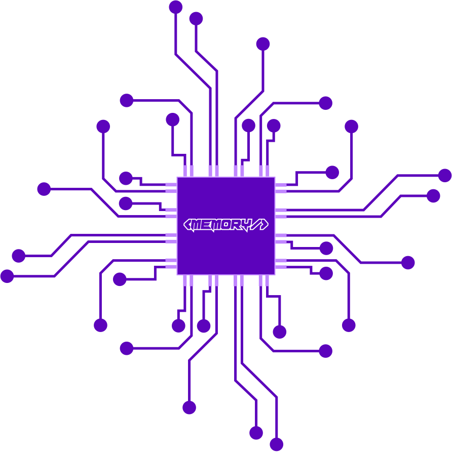

# Memory Game



## Description

The Memory Game is a classic card-flipping game where the player must find matching pairs of cards. The objective is to uncover all the pairs within a specified number of moves.

## Motivation

This game was created as a fun project to showcase React and Redux-toolkit skills while providing an enjoyable gaming experience.

## Installation

1. Fork this repository.
2. Clone your forked repository to your local machine.
3. Navigate to the project directory in your terminal.
4. Run the following command to install the dependencies:
   ```shell
   npm install
   ```
5. Start the game by running the command:
   ```shell
   npm start
   ```

## Usage

- Click on a card to flip it over and reveal its image.
- Memorize the cards' positions and try to find matching pairs.
- Click on a second card to flip it over.
- If the cards match, they will disappear.
- If the cards do not match, they will be flipped back over.
- Continue uncovering pairs until all cards are matched.

## Demo


## Contributing

Contributions to this project are welcome! If you find any issues or have ideas for improvements, please submit a pull request. Bug reports and feature requests are also encouraged.

## License

This project is licensed under the MIT License. You are free to use this project for any purpose, including commercial applications
